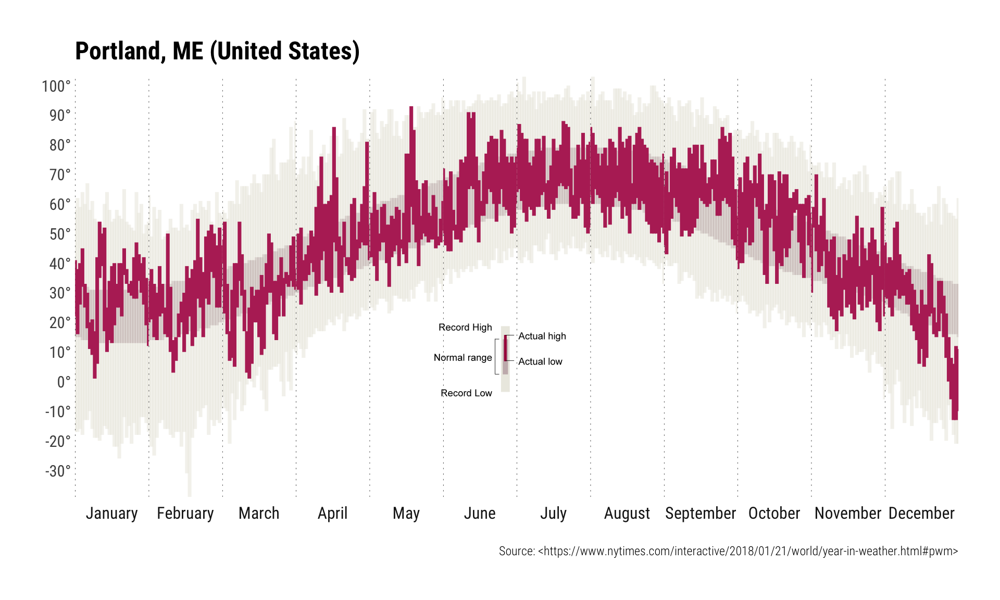

# What is this?

The New York Times created a [neat ’splainer
vis](https://www.nytimes.com/interactive/2018/01/21/world/year-in-weather.html#pwm)
for over 3,000 global temperatures across 2017. They made the data
available as individual CSV files, but they all fit quite nicely in an
xz-compressed R data file.

It’s a great data set for intro DS courses (IMO).

There’s a basic plotting function (below) to mimic the main graph,
including the legend (which is built with a picture grob vs a plethora
of ggplot2 annotation code).

NOTE: NYT had data in &deg;F so the data here is in &deg;F



<!-- README.md is generated from README.Rmd. Please edit that file -->

``` r
library(hrbrthemes)
library(grImport)
library(tidyverse)
```

``` r
# data behind https://www.nytimes.com/interactive/2018/01/21/world/year-in-weather.html#pwm
city_wx <- read_rds("city_wx.rds")

glimpse(city_wx)
## Observations: 1,401,235
## Variables: 25
## $ date                                <date> 2017-01-01, 2017-01-02, 2...
## $ month                               <int> 1, 1, 1, 1, 1, 1, 1, 1, 1,...
## $ temp_max                            <int> 68, 70, 70, 73, 72, 72, 73...
## $ temp_min                            <int> 57, 59, 63, 68, 61, 61, 63...
## $ temp_rec_max                        <int> NA, NA, NA, NA, NA, NA, NA...
## $ temp_rec_min                        <int> NA, NA, NA, NA, NA, NA, NA...
## $ temp_avg_max                        <int> 69, 69, 69, 69, 69, 69, 69...
## $ temp_avg_min                        <int> 59, 59, 59, 59, 59, 59, 59...
## $ temp_rec_high                       <chr> NA, NA, NA, NA, NA, NA, NA...
## $ temp_rec_low                        <chr> NA, NA, NA, NA, NA, NA, NA...
## $ precip_value                        <dbl> 0.00, 0.00, 0.00, 0.13, 1....
## $ precip_actual                       <dbl> 5.71, 5.71, 5.71, 5.71, 5....
## $ precip_normal                       <chr> "4.40", "4.40", "4.40", "4...
## $ precip_rec                          <chr> NA, NA, NA, NA, NA, NA, NA...
## $ snow_rec                            <chr> NA, NA, NA, NA, NA, NA, NA...
## $ annual_average_temperature          <dbl> 72.84658, 72.84658, 72.846...
## $ departure_from_normal               <dbl> 2.589041, 2.589041, 2.5890...
## $ total_precipitation                 <dbl> 38.58, 38.58, 38.58, 38.58...
## $ precipitation_departure_from_normal <dbl> 36.4, 36.4, 36.4, 36.4, 36...
## $ id                                  <chr> "txkf", "txkf", "txkf", "t...
## $ latitude                            <dbl> 32.36, 32.36, 32.36, 32.36...
## $ longitude                           <dbl> -64.68, -64.68, -64.68, -6...
## $ name                                <chr> NA, NA, NA, NA, NA, NA, NA...
## $ state                               <chr> NA, NA, NA, NA, NA, NA, NA...
## $ country                             <chr> "Bermuda", "Bermuda", "Ber...

# converted from legend on https://www.nytimes.com/interactive/2018/01/21/world/year-in-weather.html#pwm
legend <- readPicture("leg.ps.xml")
```

``` r
wx_rec_plot <- function(city_id, celsius) {

  place <- filter(city_wx, id == city_id)
  place <- mutate(place, month = lubridate::month(date, label=TRUE, abbr=FALSE))

  if (is.na(place$name[1]) & is.na(place$state[1])) {
    place_title <- place$country[1]
  } else if ((!is.na(place$name[1])) & (is.na(place$state[1]))) {
    place_title <- sprintf("%s (%s)", place$name[1], place$country[1])
  } else {
    place_title <- sprintf("%s, %s (%s)", place$name[1], place$state[1], place$country[1])
  }


  data_frame(
    date = seq(as.Date("2017-01-01"), length=12, by="1 month"),
    month = lubridate::month(date, label=TRUE, abbr=FALSE)
  ) -> month_start

  breaks_12 <- scales::pretty_breaks(12)
  break_lab <- function(x) { sprintf("%s°", x)}

  gg <- ggplot()

  if (!any(is.na(place$temp_rec_min))) {
    gg <- gg +
      geom_segment(
        data = place,
        aes(x=date, xend=date, y=temp_rec_min, yend=temp_rec_max),
        color="#ecebe3", alpha=3/5, size=1.25
      )
  }

  gg +
    geom_segment(
      data = place,
      aes(x=date, xend=date, y=temp_avg_min, yend=temp_avg_max),
      color="#c8b8b9", alpha=2/5, size=1.25
    ) +
    geom_segment(
      data = month_start,
      aes(
        x=date, xend=date,
        y=min(place$temp_rec_min, na.rm = TRUE),
        yend=max(place$temp_rec_max, na.rm = TRUE)
      ),
      linetype="dotted", size=1/4
    ) +
    geom_segment(
      data = place,
      aes(x=date, xend=date, y=temp_min, yend=temp_max),
      color="#b72f65", size=1.25
    ) +
    scale_x_date(expand=c(0,0)) +
    scale_y_continuous(expand=c(0,0), breaks=breaks_12, labels=break_lab) +
    facet_wrap(~month, nrow=1, strip.position = "bottom", scales="free_x") +
    labs(
      x=NULL, y=NULL,
      title=place_title,
      caption="Source: <https://www.nytimes.com/interactive/2018/01/21/world/year-in-weather.html#pwm>"
    ) +
    theme_ipsum_rc(grid="") +
    theme(strip.text.x = element_text(hjust = 0.5)) +
    theme(axis.text.x = element_blank()) +
    theme(panel.spacing.x = unit(0, "null")) -> gg

  gb <- ggplotGrob(gg)

  grid.newpage()
  grid.draw(gb)
  grid.draw(
    pictureGrob(legend, y=0.4, width=unit(1.25, "grobwidth", gb))
  )

}
```

``` r
filter(city_wx, state == "ME", name == "Portland") %>%
  pull(id) %>%
  unique() %>%
  wx_rec_plot()
```


